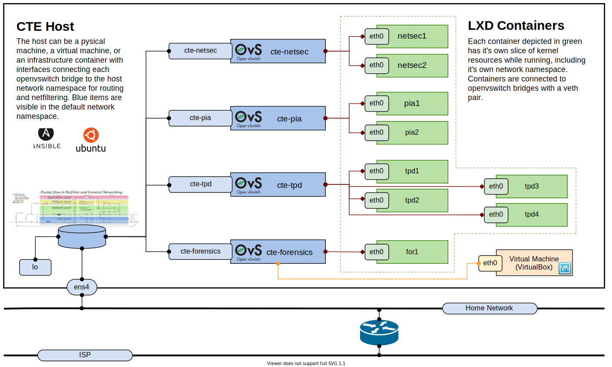

# Networking

This guide explains some of the networking features of the CTE and how to manage networking configuration.

## Introduction

The CTE relies on a combination of OpenvSwitch bridges and LXD infrastructure containers to provide a robust networking environment.  The OpenvSwitch bridges are usually managed by the LXD daemon, or are created directly in the OVS system.  Bridges can exist in the default network namespace, or in another network namespace to provide isolation and advanced routing functionality.



## Getting network information

You can use a variety of Linux utilities such is `ip`, `hostnamectl`, `ss`, and `nmap`, as well as the `lxc` and `ovs-vsctl` utilities to get access to network information.  Below are some of the common tasks for networking in the CTE.

### Task examples

Listing interfaces with `networkctl list`.

```bash
$ networkctl list
IDX LINK             TYPE               OPERATIONAL      SETUP     
  1 lo               loopback           carrier          unmanaged
  2 ens4             ether              routable         configured
  7 ovs-system       ether              off              unmanaged
  8 cte-tpd          ether              routable         unmanaged
```

---

Displaying DNS resolution settings on interface ens4 with `resolvectl status` (Ubuntu 18.10 or higher) or `systemd-resolve` (Ubuntu 18.04).

```bash
$ systemd-resolve --status ens4
$ resolvectl status ens4
Link 2 (ens4)
      Current Scopes: DNS
DefaultRoute setting: yes
       LLMNR setting: yes
MulticastDNS setting: no
  DNSOverTLS setting: no
      DNSSEC setting: no
    DNSSEC supported: no
  Current DNS Server: 10.223.79.1
         DNS Servers: 10.223.79.1
          DNS Domain: multipass
```

---

Show Open vSwitch configuration using `ovs-vsctl show`

```bash
$ sudo ovs-vsctl show
e0e86ec4-2d13-4a22-813c-d04a3cfd8be5
    Bridge cte-tpd
        Port cte-tpd
            Interface cte-tpd
                type: internal
    ovs_version: "2.12.0"
```

## References

 :information_source: [LXD - system container manager](https://lxd.readthedocs.io/en/latest/ "a next generation system container and virtual machine manager")

 :information_source: [Open vSwitch](http://docs.openvswitch.org/en/latest/ "a production quality, multilayer virtual switch")

### Man pages

:orange_book: man 8 ip

:orange_book: man 1 networkctl

:orange_book: man 8 ovs-vsctl

:orange_book: man 1 resolvectl
