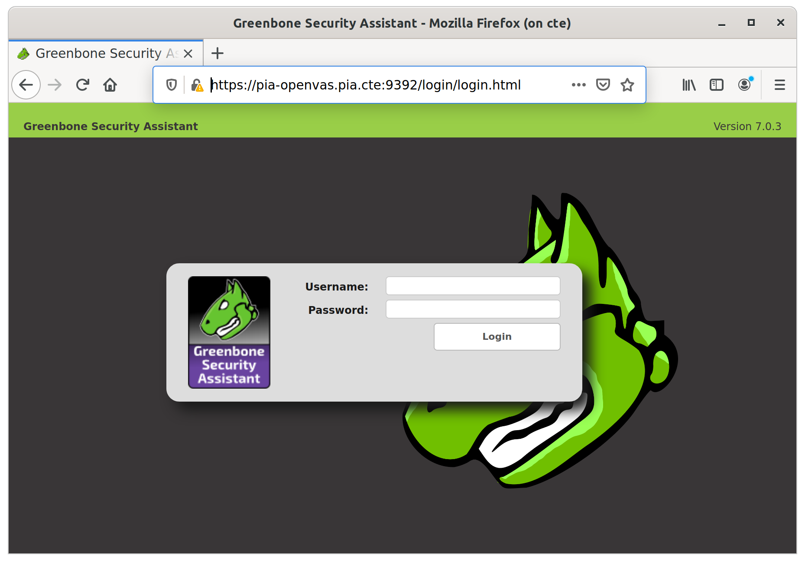
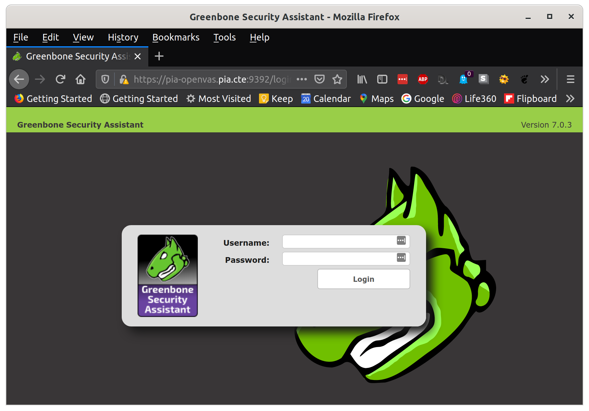

# Virtual Machines

This document provides instructions for using a virtual machine to host the CTE.  The CTE can be run on a variety of hypervisors hosted on Linux, MacOS or Windows.  A VM is not required however, if the host machine is running a Debian based distribution of Linux.  The CTE will run directly on a host running an up to date Debian based Linux distribution, such as Ubuntu.

The VM can run a full desktop version, a server version or a cloud image version of a Debian based Linux distribution.  Cloud images and server iso installers do not provide the X11 graphical environment by default, therefore GUI applications are not usable since there is no display for the applications.  Using the capabilities of X11 or Wayland, GUI applications can be installed and configured to use remote displays on Linux and MacOS.

## Running VM GUI applications on physical host using X11 forwarding

There are many ways to get a remote display of a GUI or single application on a remote server.  This example uses X11 native capabilities to run Firefox on a headless multipass VM without a display and show the GUI on the display of a host running X11.  The host can be Linux (`X11`), MacOS (`XQuartz`), or Windows (`vcxsrv`) running one of the fore mentioned X-servers.

The simplest, and by far easiest method, is to use X11Forwarding via ssh.  The CTE VM must have X11Forwarding enabled in `/etc/ssh/sshd_config` with the configuration line `X11Forwarding yes`.

You can check this from the host.

```bash
@host:~$ ssh cte "grep '^X11Forwarding' /etc/ssh/sshd_config"
X11Forwarding yes
```
You can also check this from the CTE VM.

```bash
@cte:~$ grep '^X11Forwarding' /etc/ssh/sshd_config
X11Forwarding yes
```

First connect via ssh with X11Forwarding, then run the GUI application.  The GUI will open on the host's X11 server.  Redirecting stderr to `/dev/null` keeps the session quiet on the CTE VM and pushing the process to a job releases the CTE terminal for additional input.

```bash
@host:~$ ssh -X cte
@cte:~$ firefox 2>/dev/null &
```

You should see a Firefox application window open on the host machines GUI.  Notice in the screenshot below that the name of the VM appears in the title bar of the application window to indicate what node (`on cte`) the process is running on.



# Port forwarding (DNAT)

A method that works for accessing web applications is to use port forwarding, or DNAT, to forward a port from the VM's interface to the host, over to another host and port accessible from the VM.  This is possible when the traffic from the VM to the host is using SNAT to translate the CTE networks to the network on the host.  You can use `iptables` to place a rule in the `nat` table of the `PREROUTING` chain to change the destination address and port.

On the CTE VM, identify the interface name used as a gateway to the host, and use that interface name to forward to other host's IP:port addresses.  Here's an example that forwards port 9392 to the pia-openvas container in the `pia` network running OpenVAS on port 9392.

Find the default gateway device name and ip address.

```bash
$ ip route list default
default via 10.223.79.1 dev ens4 proto dhcp src 10.223.79.250 metric 100
$ ip -c -br -4 addr show ens4
ens4             UP             10.223.79.250/24
```

Find the ip address of the pia-openvas container and confirm it is accessible from the cte node.

```bash
$ lxc list pia-openvas
+-------------+---------+----------------------+------+-----------+-----------+
|    NAME     |  STATE  |         IPV4         | IPV6 |   TYPE    | SNAPSHOTS |
+-------------+---------+----------------------+------+-----------+-----------+
| pia-openvas | RUNNING | 10.120.113.53 (eth0) |      | CONTAINER | 0         |
+-------------+---------+----------------------+------+-----------+-----------+
$ ip route get 10.120.113.53
10.120.113.53 dev cte-pia src 10.120.113.1 uid 1000
```

Check the pia-openvas container to confirm that port 9392 is listening for connections.

```bash
$ ssh pia-openvas ss -lnt4 | grep :9392
LISTEN    0         128                0.0.0.0:9392             0.0.0.0:*
```

Add a DNAT rule to forward traffic from the host network to the pia-openvas node on the guest network.

```bash
$ sudo iptables -t nat -A PREROUTING -i ens4 -p tcp --dport 9392 -j DNAT --to 10.120.113.53:9392
```
Now switch terminals and connect to a shell on the host machine.  From there, check that the port is accessible.  It's state should be `open`.  Use the ip address of the CTE gateway discovered above.

```bash
$ nmap -p 9392 10.223.79.250
Starting Nmap 7.80 ( https://nmap.org ) at 2020-04-26 08:33 EDT
Nmap scan report for pia-openvas.pia.cte (10.223.79.250)
Host is up (0.00035s latency).

PORT     STATE SERVICE
9392/tcp open  unknown

Nmap done: 1 IP address (1 host up) scanned in 0.06 seconds
```

Since OpenVAS is running the Greenbone Security Assistant (GSA) as a webserver that responds only to a valid hostname, you must resolve the GSA hostname from the host so that it resolves to the CTE VM's ip address.  This can be done by adding an entry to the `/etc/hosts` file, or on windows, the `C:\Windows\System32\Drivers\etc\hosts` file.  The ip address must be first on the line, and can only appear once in the file. The first name is treated like an `A` record in DNS and each subsequent alias is treated like a `CNAME` record.  here's an example entry.

```
10.223.79.250 cte pia-openvas.pia.cte pia-openvas
```

This configuration allows an http client to correctly pass a valid hostname header in the `HTTP GET` message when connecting to the OpenVAS server.  You can see below that `curl` successfully negotiates a TLS handshake and connects to the `pia-openvas` container at port `9392`, then successfully issues an `HTTP HEAD` request using the `Host` header `pia-openvas.pia.cte:9392`.  The server responds with an `HTTP/1.1 405 Method Not Allowed` to say the `HEAD` method is not allowed according to the servers configuration.

```bash
$ curl -v -I --insecure https://pia-openvas.pia.cte:9392/login/login.html
*   Trying 10.223.79.250:9392...
* TCP_NODELAY set
* Connected to pia-openvas.pia.cte (10.223.79.250) port 9392 (#0)
* ALPN, offering h2
* ALPN, offering http/1.1
* successfully set certificate verify locations:
*   CAfile: none
  CApath: /etc/ssl/certs
* TLSv1.3 (OUT), TLS handshake, Client hello (1):
* TLSv1.3 (IN), TLS handshake, Server hello (2):
* TLSv1.2 (IN), TLS handshake, Certificate (11):
* TLSv1.2 (IN), TLS handshake, Server finished (14):
* TLSv1.2 (OUT), TLS handshake, Client key exchange (16):
* TLSv1.2 (OUT), TLS change cipher, Change cipher spec (1):
* TLSv1.2 (OUT), TLS handshake, Finished (20):
* TLSv1.2 (IN), TLS handshake, Finished (20):
* SSL connection using TLSv1.2 / AES256-GCM-SHA384
* ALPN, server did not agree to a protocol
* Server certificate:
*  subject: CN=pia-openvas.pia.cte; O=OpenVAS Users; L=Osnabrueck; C=DE
*  start date: Apr 23 12:11:31 2020 GMT
*  expire date: Apr 23 12:11:31 2022 GMT
*  issuer: OU=Certificate Authority for pia-openvas.pia.cte; O=OpenVAS Users; L=Osnabrueck; C=DE
*  SSL certificate verify result: unable to get local issuer certificate (20), continuing anyway.
> HEAD /login/login.html HTTP/1.1
> Host: pia-openvas.pia.cte:9392
> User-Agent: curl/7.65.3
> Accept: */*
>
* Mark bundle as not supporting multiuse
< HTTP/1.1 405 Method Not Allowed
HTTP/1.1 405 Method Not Allowed
< Connection: Keep-Alive
Connection: Keep-Alive
< Content-Length: 51
Content-Length: 51
< Content-Security-Policy: default-src 'self' 'unsafe-inline'; img-src 'self' blob:; frame-ancestors 'self'
Content-Security-Policy: default-src 'self' 'unsafe-inline'; img-src 'self' blob:; frame-ancestors 'self'
< X-Frame-Options: SAMEORIGIN
X-Frame-Options: SAMEORIGIN
< Content-Type: text/html; charset=utf-8
Content-Type: text/html; charset=utf-8
< Date: Sun, 26 Apr 2020 12:52:54 GMT
Date: Sun, 26 Apr 2020 12:52:54 GMT
```
Now try using *Firefox* to connect to the forwarded port on the CTE VM from the host.



## Running VM GUI applications without X11 Forwarding

**⮦ ⮦ ⮦ ⮦ ⮦**    *Below section incomplete*    **⮧ ⮧ ⮧ ⮧ ⮧**

---

It is possible that the UID of the user account on the Host and the CTE VM is different.  Make sure to generate or use an `.Xauthority` file for the appropriate user when logged in the each shell.

Determine the location of the `Xauthority` file on the host system.

```bash
user@host:~$ echo ${XAUTHORITY}
/run/user/1000/gdm/Xauthority
```
Determine your user account effective id in the CTE virtual machine.

```bash
user@host:~$ ssh cte "id -u"
1000
```

Map the host `Xauthority` file to the CTE virtual machine using a multipass directory mount.

```bash
user@host:~$ multipass mount /tmp/.X11-unix cte:/tmp/.X11-unix
```

Determine the host display number and IPv4 address to the virtual machine's multipass network.

```bash
user@host:~$ echo ${DISPLAY}
:1
user@host:~$ ip -c -br -4 addr show dev mpqemubr0 | awk '{print $3}' | cut -d/ -f1
10.223.79.1
```

---

**⮤ ⮤ ⮤ ⮤ ⮤**    *Above section incomplete*    **⮥ ⮥ ⮥ ⮥ ⮥**


## Multipass Orchestration

Multipass is an orchestration tool that stores vm instance configuration data in a json file regardless of underlying hypervisor.

- Linux - `/var/snap/multipass/common/data/multipassd/multipassd-vm-instances.json`
- Windows - `C:\Windows\System32\config\systemprofile\AppData\Roaming\multipassd\multipassd-vm-instances.json`
- MacOS - `/var/root/Library/Application Support/multipassd/multipassd-vm-instances.json`

There are a couple of environment variables you can set to control default configuration settings for vm creation under multipass.

```bash
SNAPCRAFT_BUILD_ENVIRONMENT_CPU=4
SNAPCRAFT_BUILD_ENVIRONMENT_MEMORY=8G
```

### Multipass on Windows using VirtualBox

You can still get access to the underlying virtualbox manager.

```dos
C:\> psexec.exe -s -i VirtualBox
```
